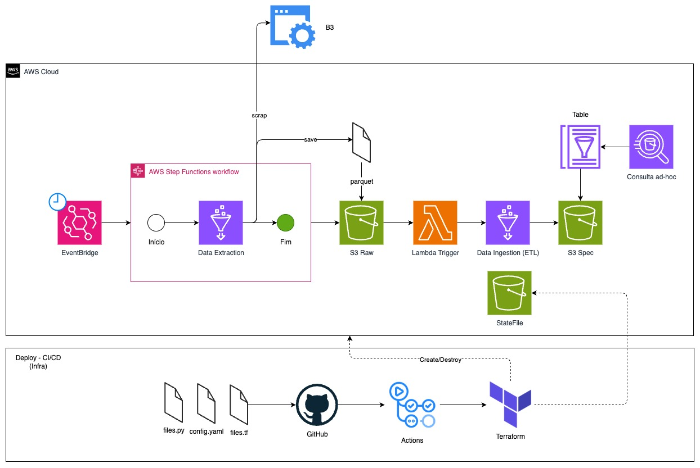

# 🚀 Tech Challenge Fase 2 - Pipeline Batch Bovespa

## 📖 O Desafio

Construir uma pipeline de dados utilizando serviços AWS (Glue, S3, Lambda e Athena) para processar e analisar dados do mercado financeiro brasileiro (Bovespa). A pipeline deve ser capaz de ingerir dados brutos, processá-los e armazená-los em um formato otimizado para consultas analíticas.

## 🏗️ Arquitetura



## Serviços AWS e Tecnologias Utilizadas

- AWS Lambda
- AWS S3
- AWS IAM
- AWS CloudWatch
- AWS EventBridge
- AWS Step Functions
- AWS Glue
- AWS Athena
- Terraform
- Python

## 📂 Estrutura do Projeto

```
fiap_tech_challenge_fase2/
├── app/
│   ├── lambda/
│   │   ├── main.py
│   │   └── requirements.txt
│   └── glue/
│       ├── data_extraction.py
│       ├── data_transformation.py
│       └── utils/
│           ├── data_reader.py
│           └── data_writer.py
├── infra/
│   ├── iam/
│   │   ├── policies/
│   │   │   ├── policy_lambda.json
│   │   │   ├── policy_glue.json
│   │   │   ├── policy_sfn.json
│   │   │   └── policy_eventbridge.json
│   │   └── trust/
│   │       ├── trust_lambda.json
│   │       ├── trust_glue.json
│   │       ├── trust_sfn.json
│   │       └── trust_eventbridge.json
│   ├── inventories/
│   │   └── prod.tfvars
│   ├── lambda.tf
│   ├── s3.tf
│   ├── iam.tf
│   ├── main.tf
│   ├── locals.tf
│   ├── eventbridge.tf
│   ├── sfn.tf
│   ├── glue.tf
│   ├── tables.tf
│   ├── version.tf
│   ├── provider.tf
│   └── variables.tf
└── README.md
```

## ⚙️ Configuração - config.yaml

O arquivo `config.yaml` contém todos os parâmetros necessários para o deploy da infraestrutura. Abaixo está a descrição detalhada de cada parâmetro:

### Setup

```yaml
setup:
  python_version: "3.11"
```

- **python_version**: Versão do Python utilizada nos scripts Lambda e Glue. Define a runtime dos serviços AWS que executam código Python.

### AWS

```yaml
aws:
  region: "us-east-1"
```

- **region**: Região AWS onde todos os recursos serão provisionados.

### Terraform

```yaml
terraform:
  destroy: false
  auto_approve: true
  backend:
    s3_bucket: "terraform-state-197045787308"
    key: "techchallenge2/terraform.tfstate"
    region: "us-east-1"
    account_id: "197045787308"
```

#### Parâmetros Principais

- **destroy**: Define se o comando `terraform destroy` será executado automaticamente
  - `false`: Apenas provisiona recursos (padrão para ambientes produtivos)
  - `true`: Destrói todos os recursos criados

#### Backend Configuration

- **s3_bucket**: Nome do bucket S3 que armazena o state file do Terraform
  - Deve ser único globalmente
  - Recomenda-se incluir o account ID no nome para garantir unicidade

- **key**: Caminho dentro do bucket onde o state file será armazenado
  - Formato sugerido: `{projeto}/{ambiente}/terraform.tfstate`
  - Permite organizar múltiplos projetos no mesmo bucket

- **region**: Região AWS onde o bucket de state está localizado
  - Pode ser diferente da região dos recursos principais
  - Recomenda-se manter na mesma região para melhor performance

- **account_id**: ID da conta AWS onde os recursos serão provisionados
  - Usado para validação e construção de ARNs
  - Formato: 12 dígitos numéricos

## Autores

- [Iago Victor](https://www.linkedin.com/in/iiagovictor/)
- [Jaderson Damasceno](https://www.linkedin.com/in/jadersondamasceno/)
- [Luis Rodrigues](https://www.linkedin.com/in/lhmrodrigues/)
- [Vitor Santiago](https://www.linkedin.com/in/vitor-santiago-a7b15a14b/)

---

⭐ **Gostou?** Dê uma estrela no repositório!